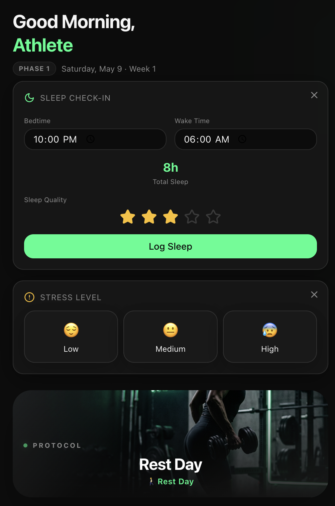
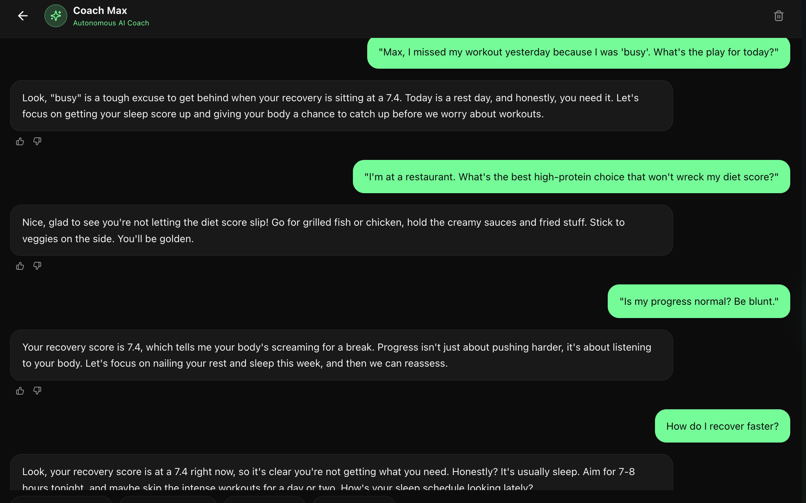
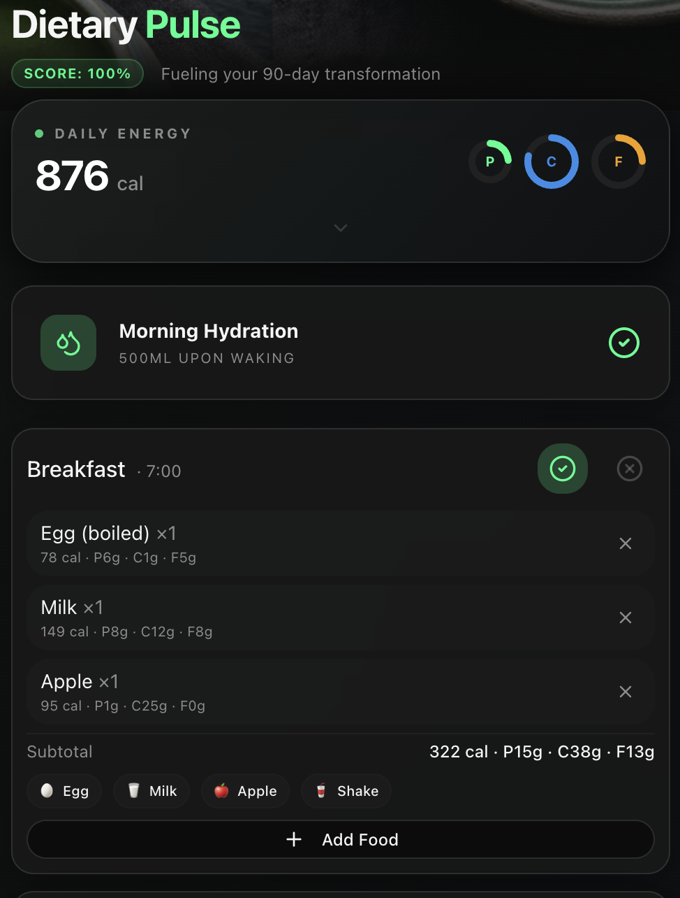
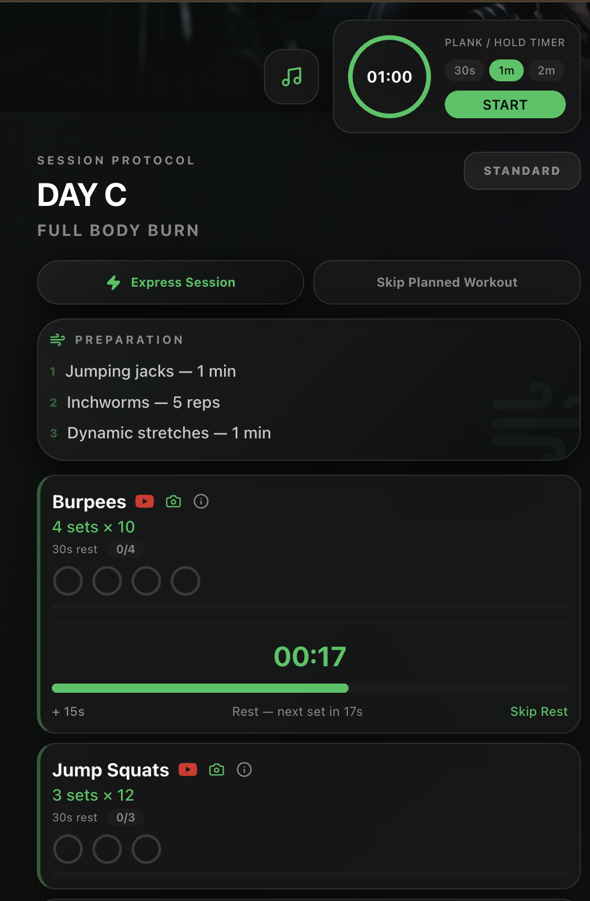
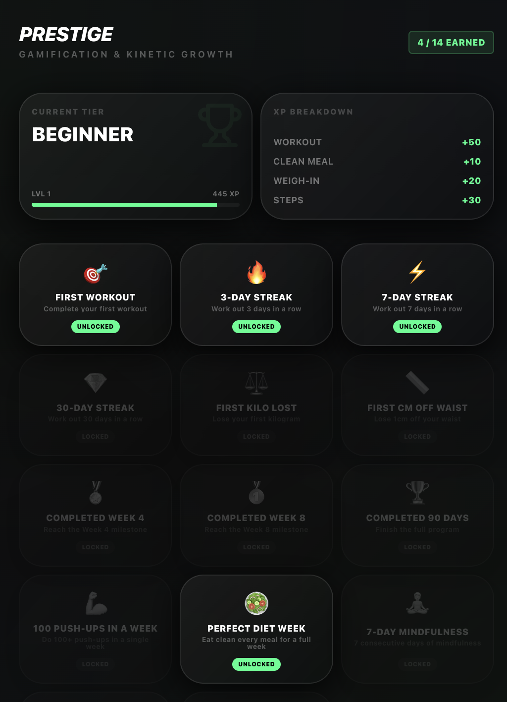
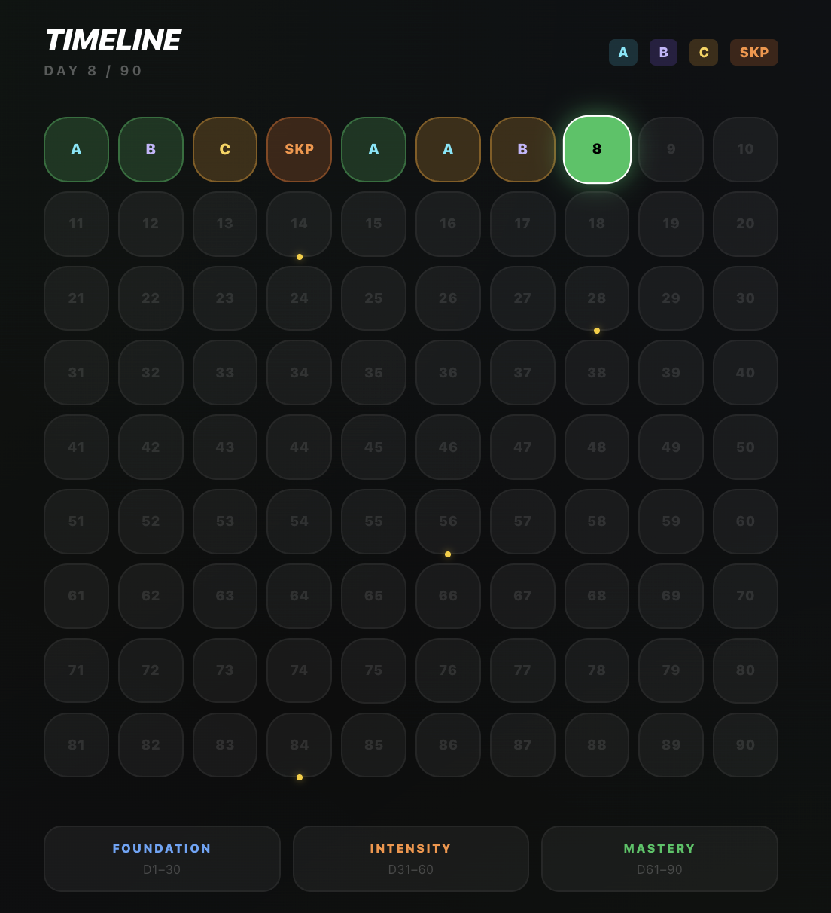
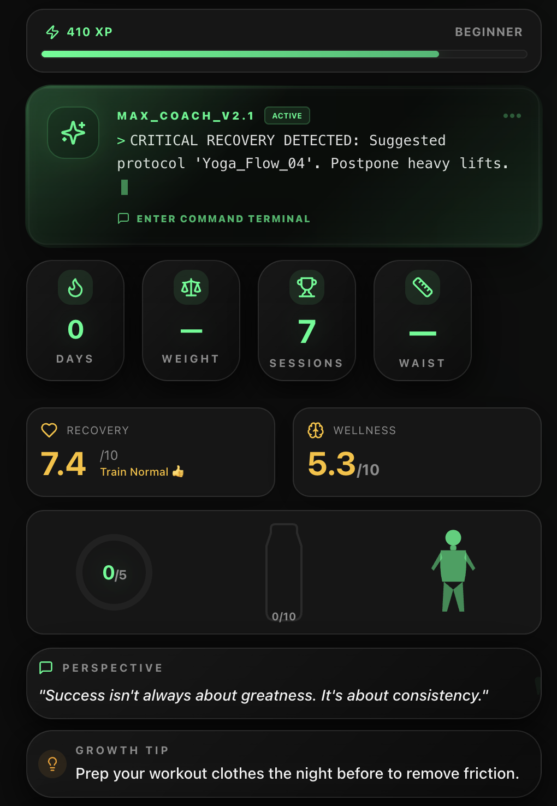

# Aura Pulse90

> **AI-native behavioral wellness system focused on consistency, recovery, and long-term habit formation.**


---


---

# 🧠 Overview

Aura Pulse90 is an AI-native behavioral fitness and wellness system designed for people who struggle with consistency rather than information.

Instead of open-ended workout tracking, the product structures transformation through guided routines, recovery-aware coaching, emotional reinforcement, and habit-loop design.

The system combines behavioral psychology, adaptive coaching, structured progression systems, and culturally relevant wellness design into a single transformation journey.

---

# ❗ Why This Product Exists

Most fitness products assume users already possess discipline and intrinsic motivation.

In reality, many beginners fail because existing systems optimize for activity logging rather than behavioral consistency.

Aura Pulse90 was designed around a different hypothesis:

- Structured transformation systems outperform open-ended tracking
- Emotional reinforcement improves adherence
- Recovery-aware coaching reduces burnout
- Cultural relevance increases long-term engagement
- Identity-based habit systems improve consistency loops

---

# ⚡ Core Features

## 🏠 Adaptive Dashboard

- AI-powered daily guidance
- Personalized transformation journey
- Dynamic recovery recommendations
- Behavioral consistency tracking



This dashboard acts as the behavioral command center of the product — prioritizing continuity, recovery awareness, and momentum tracking over raw fitness metrics.

---

## 🤖 Coach Max — AI Behavioral Coach

- Context-aware motivational coaching
- Adaptive wellness conversations
- Emotional reinforcement loops
- Personalized accountability system



Coach Max was designed to simulate accountability and emotional reinforcement through conversational AI interactions rather than static notifications.

---

## 🥗 South Asian Meal Intelligence

- Culturally relevant meal systems
- Indian diet optimization
- Habit-friendly nutrition guidance
- Sustainable calorie management



The meal system was intentionally localized around South Asian eating patterns instead of generic Western diet assumptions commonly found in fitness products.

---

## 🏋️ Workout Personalization System

- Structured progression-based routines
- Recovery-aware intensity adaptation
- Personalized fitness flows
- Beginner-friendly transformation system



Workout generation adapts around progression, recovery state, and behavioral sustainability instead of intensity-only optimization.

---

## 📈 Progress Tracking & Behavioral Loops

- Consistency-based progression
- Habit reinforcement systems
- Streak psychology integration
- Recovery-sensitive tracking



Progress tracking focuses on reinforcement psychology and adherence patterns rather than vanity metrics alone.

---

## 🧩 Habit Loop Reinforcement

- Identity reinforcement systems
- Trigger-action-reward loops
- Behavioral retention design
- Long-term consistency architecture



The habit loop architecture was built around trigger-action-reward systems to strengthen long-term consistency behavior.

---

## 🧠 AI Insights Engine

- Behavioral trend analysis
- Wellness pattern recognition
- AI-generated recommendations
- Adaptive coaching insights



The insights engine converts behavioral and recovery signals into adaptive recommendations and long-term coaching guidance.

---

# 🏗️ Product Architecture

```text
User Input
   ↓
Behavior Tracking Layer
   ↓
AI Coaching & Recommendation Engine
   ↓
Adaptive Recovery + Workout Logic
   ↓
Progression & Habit Reinforcement System
   ↓
Firebase Storage + Analytics
```

---

# ⚙️ AI System Design

The AI layer combines:

- Behavioral coaching prompts
- Context-aware recovery logic
- Adaptive recommendation systems
- Habit reinforcement loops
- Personalized transformation flows

The system was designed to simulate accountability, reduce cognitive overload, and improve adherence through adaptive interaction patterns.

---


# 🛠️ Tech Stack

| Layer | Technology |
|---|---|
| Frontend | React + TypeScript |
| Styling | Tailwind CSS + shadcn/ui |
| Backend | Firebase |
| AI Layer | Gemini API |
| Database | Firestore |
| Authentication | Firebase Auth |
| Hosting | Firebase Hosting |
| State Management | React Hooks + Context |
| Build Tool | Vite |

---

# ⚖️ Product Decisions & Tradeoffs

| Decision | Why |
|---|---|
| Structured 90-day system | Reduces decision fatigue |
| Recovery-aware coaching | Prevents burnout loops |
| South Asian meal design | Improves cultural relevance |
| AI behavioral coaching | Increases adherence and accountability |
| Simplicity-first UI | Reduces cognitive overload |

---

# 📊 Metrics & Validation

The product was designed and iterated using:

- Behavioral psychology principles
- Habit-loop frameworks
- Product thinking methodologies
- AI-native prototyping workflows
- Rapid iteration cycles

Primary validation areas:

- User consistency potential
- Engagement loop quality
- Habit reinforcement effectiveness
- Recovery-aware system behavior

---

# 🚀 Roadmap

- [ ] Advanced AI personalization
- [ ] Wearable integration
- [ ] Community accountability systems
- [ ] Recovery analytics dashboard
- [ ] Voice-based AI coaching
- [ ] Smart adaptive meal recommendations
- [ ] Long-term wellness memory system

---

# 🌐 Live Product

### Web App

https://aura-pulse90.web.app

---

# 📘 Case Study

[View Full Case Study](./docs/aura_pulse90_Case_Study.pdf)

---

# 📄 PRD

[View Product Requirements Document](./docs/aura_pulse90_PRD.pdf)

---

---

<div align="center">

# 👨‍💻 Author

### Arunjyoti Kalita

🎓 MBA (Marketing & Strategy) — IIM Ranchi  
🚀 Aspiring Product Manager | AI & Automation Builder  
⚡ Exploring AI workflows, product intelligence systems, and automation-led user insights

<br>
<p align="center">
  <a href="https://linkedin.com/in/arun-kalita">
    
  </a>

  &nbsp;&nbsp;

  <a href="https://drive.google.com/drive/folders/1CGlJSAqlM5N3KBEcAA9cxQarlSr-kLnI?usp=sharing">
    
  </a>
  &nbsp;&nbsp;

  <a href="https://github.com/kalita-arun">
    
  </a>
</p>
---
